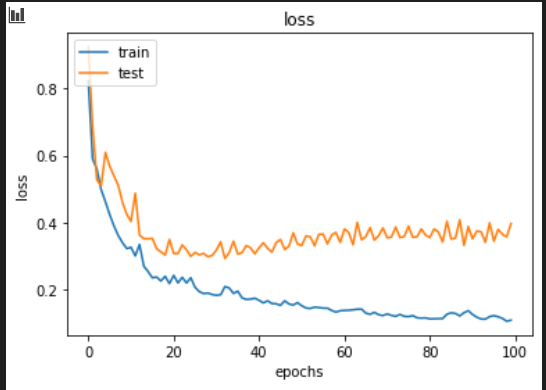
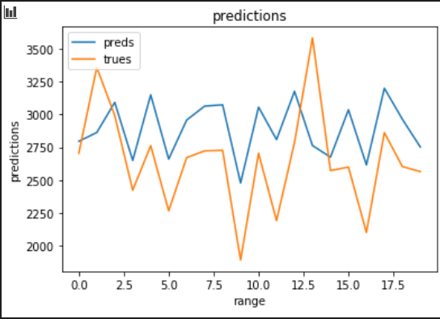
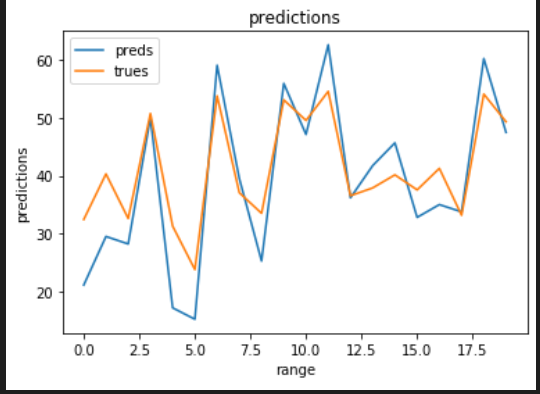

# NAS.py

# Overfit model (64-32-32) on small dataset

---------------------------------
 

# Multiple Inputs

## Dense (on HW param): 

### Dense 32 x Dense 32 x Dense 1

1313 params : not learning

|  Epochs |     Val_loss    |  Still done|
|:--------------:|:------------------:|:----------------------:|
|  |            | 

## Conv1D :

# Full Conv 1D

## Bottleneck ?

Params : 9,665

model_0= tf.keras.Sequential([

     layers.Conv1D(32, (3), activation='relu', padding="same"),

     layers.Conv1D(32*2, (1), activation='relu', padding="same"),

     layers.Conv1D(32, (3), activation='relu', padding="same"),

     layers.Conv1D(1, (3), activation='relu', padding="same"),

     layers.Lambda( lambda x: K.sum(x, axis=1)),
 ])

|  Epochs |     Val_loss    |  Still done|
|:--------------:|:------------------:|:----------------------:|
| 20 epochs | Best  **0.38**            | No 

## Model (32-3)-Drop-(64-1)-Drop-(32-3)-Drop-(1-3)

Params : 15,937  
Drop = 0.1

|  Epochs |     Val_loss    |  Still done|
|:--------------:|:------------------:|:----------------------:|
| 20 epochs | Best  **0.38**            | No 

## Model 64-32-32 

 
 Params : 11,937  
 Ini learning rate = 1e-2

|  Epochs |     Val_loss    |  Still done| 
|:--------------:|:------------------:|:----------------------:|
| 5 |  **0.41**            | Yes |
| 8 |  **0.33**            | No |
| Batchnorm |  **0.31**         | Unstable (sometimes 0.8) |

## Model (128-12)x(8-2)x(32-6)x(1-3)

 Params : 23,817  
 **Ini learning rate = 1e-1**

|  Epochs |     Val_loss    |  Still done| 
|:--------------:|:------------------:|:----------------------:|
| 5 |  **0.41**            | Yes |

## Model 2x(7) GOOD

|  Epochs |     Val_loss    |  Still done| 
|:--------------:|:------------------:|:----------------------:|
| 5 |  **0.365**            | Yes  FAST|
| 8 |  **0.33**            | Yes |

## Model 128 

|  Epochs |     Val_loss    |  Still done  | 
|:--------------:|:------------------:|:----------------------:|
| 5 |  0.35            | Ok |
| 20 |  0.4           | Then overfits |

## Model (64x2)-(32x2)-(32x2)  

|  Epochs |     Val_loss    |  Still done| 
|:--------------:|:------------------:|:----------------------:|
| 12 |  **0.33**            | No |

## Model 16-16-16-32-32-32-64-64 - DEPTH 8

 |  Epochs |     Val_loss    |  Still done| 
|:--------------:|:------------------:|:----------------------:|
| 7 |  **0.625**            | Yes |

## Model (64x6)-(32x6)-(32x6)  

|  Epochs |     Val_loss    |  Still done| 
|:--------------:|:------------------:|:----------------------:|
| 5 |  **0.62**            | Yes |

## Model (64x4)-(32x4)-(32x4)  

|  Epochs |     Val_loss    |  Still done| 
|:--------------:|:------------------:|:----------------------:|
| 5 |  **0.625**            | Yes |

## Model (64x2)-(32x1)-(32x2)  

|  Epochs |     Val_loss    |  Still done| 
|:--------------:|:------------------:|:----------------------:|
| 1 |  **0.36**            | No = Overfits direct |

## Model 64-64-32

|  Epochs |     Val_loss    |  Still done| 
|:--------------:|:------------------:|:----------------------:|
| 5 |  0.62            | Yes |

## Model 32-32-32 BEST BIS

|  Epochs |     Val_loss    |  Still done| 
|:--------------:|:------------------:|:----------------------:|
| 5 |  0.39            | Yes |

## Model 8-8-8

|  Epochs |     Val_loss    |  Still done| 
|:--------------:|:------------------:|:----------------------:|
| 4 |  0.37        | Stop 20 epochs |

## Model 8-16-256

|  Epochs |     Val_loss    |  Still done  | 
|:--------------:|:------------------:|:----------------------:|
| 5 |  0.62           | Bof |

## Model 128-64

|  Epochs |     Val_loss    |  Still done| 
|:--------------:|:------------------:|:----------------------:|
| 5 |  0.62            | Yes |

## Model 63-32

|  Epochs |     Val_loss    |  Still done  | 
|:--------------:|:------------------:|:----------------------:|
| 5 |  0.5/0.46             | Bof |

# With dense layers:

## Model 0

model_0_norm= tf.keras.Sequential([
     layers.Conv1D(64, (3), activation='relu', padding="same",input_shape=(36, 12)),
     layers.Conv1D(32, (3), activation='relu', padding="same"),
     layers.Conv1D(32, (3), activation='relu', padding="same"),
     **layers.Dense(1, activation='linear'),**
     layers.Lambda( lambda x: K.sum(x, axis=1)),
 ])

|  Epochs |     Val_loss    |  Still done| 
|:--------------:|:------------------:|:----------------------:|
| 5 |  **0.40** (1 epoch)            | Yes |
| 15 |  **0.36**          | Yes |

## Model 1

model_1= tf.keras.Sequential([
     layers.Conv1D(16, (3), activation='relu', padding="same",input_shape=(36, 12)),
     layers.Conv1D(16, (3), activation='relu', padding="same"),
     layers.Conv1D(16, (3), activation='relu', padding="same"),
     layers.Conv1D(32, (3), activation='relu', padding="same"),
     layers.Conv1D(32, (3), activation='relu', padding="same"),
     layers.Conv1D(32, (3), activation='relu', padding="same"),
     layers.Conv1D(64, (3), activation='relu', padding="same"),
     layers.Conv1D(64, (3), activation='relu', padding="same"),
     layers.Dense(1, activation='linear'),
     layers.Lambda( lambda x: K.sum(x, axis=1)),
 ])

|  Epochs |     Val_loss    |  Still done| 
|:--------------:|:------------------:|:----------------------:|
| 7 |  **0.62**            | Yes |

